<div align="center">

# D4PG-QR-FRM
### Deep Distributional Deterministic Policy Gradients for Swing Option Pricing & Research Toolkit

<sup>Comprehensive research-oriented codebase for valuing constrained multi-exercise (swing) options under a jump–mean-reverting energy process using modern deep reinforcement learning.</sup>

</div>

---

## 1. Executive Summary

This repository implements a **research-grade experimental framework** for pricing and analyzing **swing options** using Deep Reinforcement Learning (DRL), centered on a modular (but currently partially stubbed) implementation of **D4PG + optional Implicit Quantile Networks (IQN)** with **Prioritized Experience Replay (PER)**, **Munchausen regularization**, **N‑step bootstrapping**, and **Monte Carlo evaluation**.  

It also provides:  
* Deterministic/controlled stochastic path generation via a **Hambly–Howison–Kluge (HHK) two-factor (OU + jump) process**  
* Classical benchmark pricers: **Least-Squares Monte Carlo (LSM)** (`lsm_swing_pricer.py`) and (placeholder) **Finite-Difference (FDM)** (`fdm_swing_pricer.py`)  
* Rich experiment automation via shell launchers (`run.sh`, `runv3.sh`)  
* Structured logging (`logs/`, `runs/`), hyperparameter persistence (`.json`), episodic evaluation CSVs, and TensorBoard summaries  
* A curated suite of **Jupyter notebooks** for validation, quantitative analysis, diagnostics, and paper figure generation  

> NOTE: Some core source modules (`agent.py`, `networks.py`, `replay_buffer.py`, `swing_env.py`, `run.py`) still contain placeholders / unfinished sections (e.g., empty `if` branches, missing method bodies). They require completion before end‑to‑end training will run. This README documents intended architecture to guide both human and AI contributors.

## 1.1 Current best-performing monthly configuration (and results)

The monthly HHK swing contract used in `run.sh` has a configuration that consistently produces strong pricing and exercise-behavior results in out-of-sample evaluations:

- Training episodes (paths): 32,768; Evaluation every 1,024 episodes on 4,096 paths
- Key RL choices: PER on; IQN off; Munchausen off; N-step = 1; gamma = 1 (reward already discounted)
- Optimizer: batch size 64; layer size 128; lr_actor 3e-4; lr_critic 2e-4; τ = 0.003
- PER schedule: alpha 0.5; beta_start 0.7; beta_frames 150k
- Exploration: Gaussian noise; epsilon 0.3 with decay 0.9999

Qualitative results summary (see `Jupyter Notebooks/RL vs LSM Analysis.ipynb` for figures):
- RL mean present value closely tracks the LSM benchmark; bootstrap 95% CI for the mean difference generally includes zero.
- Per-path PV distributions (KDE, ECDF) and total exercised quantity are aligned across methods.
- Exercise timing and hazard curves are comparable; intensity vs moneyness shows similar responsiveness when in-the-money.
- Efficiency slope (PV vs total quantity) is in the same range, indicating competitive value-per-unit allocation.

Note on discounting: because the environment reward already applies financial discounting, set `--gamma=1` and prefer `-nstep=1` to avoid double-discounting and reduce bias.

---

## 2. Mathematical & Financial Context

### 2.1 Contract Structure
A swing option grants the right to repeatedly exercise a quantity \( q_t \in [q_{\min}, q_{\max}] \) over \( N = n\_rights \) discrete times subject to a **global cap** \( Q_{\max} \) (and optionally a minimum \( Q_{\min} \)) and optional refraction constraints (minimum time between positive exercises).  

### 2.2 Payoff Mechanics

Per decision time $t$:

$$
	ext{payoff}_t = q_t \cdot \max\left(S_t - K, 0\right)
$$

Discounted path present value (PV):

$$
P_{\text{path}} = \sum_{t=1}^N e^{-r\, t\, \Delta t} \; q_t \cdot \max\left(S_t - K, 0\right)
$$

Monte Carlo estimator (risk–neutral):

$$
V_0 = \frac{1}{M} \sum_{i=1}^M P_{\text{path}, i}
$$

### 2.3 Underlying Spot (HHK Model – stylized)
Two-factor with mean-reversion and spikes:
$$
\begin{aligned}
dX_t &= -\alpha\, X_t\, dt + \sigma\, dW_t &&\text{(diffusive mean-reverting factor)}\\
dY_t &= -\beta\, Y_t\, dt + J_t\, dN_t &&\text{(jump/spike factor)}\\
S_t  &= f(t)\, e^{X_t + Y_t}\quad\text{or}\quad e^{f(t) + X_t + Y_t}\
\end{aligned}
$$
Seasonality (e.g., deterministic sinusoid) is embedded in \( f(t) \).  
Jump sizes \( J_t \) may be log-normal / exponential; intensity \( λ \).  

---

## 3. Repository Structure & File Roles

```
D4PG-QR-FRM/
├── run.py                 # MAIN orchestrator (currently incomplete – arg parse, training loop stubs)
├── run.sh                 # Batch launcher (baseline monthly config across seeds)
├── runv3.sh               # Alternative launcher variant (different hyperparams)
├── evaluate_agent.py      # Legacy evaluation utility (Gym classic style) – not yet adapted to swing env
├── src/
│   ├── agent.py           # Agent class (D4PG core – MANY placeholders to fill)
│   ├── networks.py        # Actor / Critic / IQN definitions (incomplete bodies)
│   ├── replay_buffer.py   # Circular + Prioritized replay (several method stubs)
│   ├── swing_env.py       # Gymnasium environment for swing option (partially stubbed)
│   ├── swing_contract.py  # Contract dataclass (complete; validation + helpers)
│   ├── simulate_hhk_spot.py # HHK stochastic path generation (not shown here; assumed functional)
│   ├── lsm_swing_pricer.py  # Complete Longstaff–Schwartz (benchmark) implementation
│   ├── fdm_swing_pricer.py  # FDM placeholder (extend for PDE benchmarking)
│   └── MultiPro.py        # (Likely) multi-process or vector env utility (not yet documented)
├── logs/                  # Evaluation & diagnostics CSVs (per run → nested episodes/evaluations)
├── runs/                  # Saved models (.pth), hyperparameter JSON, TensorBoard event files
├── HyperparameterTuning/  # Aggregated sweeps (CSV summaries, correlations)
├── Experiment Configs/    # Shell scripts (annual/monthly configurations)
├── Jupyter Notebooks/     # Research notebooks (see Section 10) 
├── _Longstaff-Schwartz Swing Options/  # Explanatory markdown & methodology notes
└── README.md              # (This document)
```

### Status Legend
| File | Status | Action Needed |
|------|--------|---------------|
| `swing_contract.py` | Complete | None |
| `lsm_swing_pricer.py` | Complete | Optional enhancements (variance reduction, basis diagnostics) |
| `agent.py` | Incomplete | Fill empty branches (actor/critic setup, PER integration, learning steps) |
| `networks.py` | Incomplete | Implement forward passes, weight init, `compile_for_performance()` |
| `replay_buffer.py` | Incomplete | Implement add/sample logic; finalize PER sampling weights |
| `swing_env.py` | Incomplete | Finish `step`, `reset`, observation builder & feasibility logic |
| `run.py` | Incomplete | Implement argument parsing, dataset gen, training loop hooks |
| `fdm_swing_pricer.py` | (Assumed placeholder) | Implement PDE/FDM scheme or remove reference |

---

## 4. Experiment Launch Flow (Entry Points)

1. **Shell Script (`run.sh` / `runv3.sh`)** defines an `args` bash array of CLI switches.  
2. Invokes `python run.py ${args[@]} -name <RunLabel> -seed <seed>` for each seed.  
3. `run.py` (when completed) should:  
     * Parse args → create `SwingContract` & stochastic process config  
     * Generate training & evaluation datasets via `simulate_hhk_spot`  
     * Construct `SwingOptionEnv` for train/eval (share eval dataset)  
     * Instantiate `Agent` (with PER / IQN / Munchausen toggles)  
     * Loop over **paths** (episodes), each simulating a full contract  
     * Periodically call evaluation routine → produce pricing CSV + TensorBoard scalars  
     * Persist model weights and hyperparameter JSON in `runs/`  

---

## 5. Core Components (Intended Design)

### 5.1 Environment (`swing_env.py`)
State vector (intended, final shape = 9):
$$
[\, (S_t - K),\; q_{\text{exercised\_norm}},\; q_{\text{remaining\_norm}},\; \text{time\_to\_maturity\_norm},\; \text{progress\_norm},\; S_t,\; X_t,\; Y_t,\; \text{days\_since\_last\_exercise\_norm} \,]
$$
Action: scalar in [0,1] → denormalized to [q_min, q_max].  
Reward function (financial discounting): $(df)^{t+1} q_t (S_t-K)^+$ or with \(\max(\cdot,0)\) depending on chosen variant (current code shows both lines; remove the non-clipped variant for correctness).  
Terminate when: maturity reached OR $Q\_\text{exercised} ≥ Q_{\max}$.  

### 5.2 Agent (`agent.py`)
Implements D4PG style updates:  
* Actor: deterministic policy \( a = \mu(s) \)  
* Critic: either standard Q-network or distributional IQN (quantile embedding + cosine basis)  
* Target networks: soft updated by \( \tau \)  
* Replay: uniform circular or prioritized variant  
* N‑step return aggregation prior to storage  
* Optional Munchausen reward shaping / log-policy augmentation (currently placeholder; policy log‑prob needs action distribution assumption—e.g., squashed Gaussian—for continuous domain)  

### 5.3 Replay (`replay_buffer.py`)
Two classes:  
* `CircularReplayBuffer`: Pre-allocated numpy arrays for O(1) indexing  
* `PrioritizedReplay`: Proportional priorities with importance weights (alpha/beta annealing)  

### 5.4 Networks (`networks.py`)
* `Actor`: 3×256 + LayerNorm + ReLU, final tanh / linear (currently no output activation).  
* `Critic`: (Structure TBD; typical: concat state+action then MLP).  
* `IQN`: Quantile embedding using cosine features with optional dueling head.  
* Weight initialization policy: orthogonal by default.  
* `make_compilable()` wrapper for optional `torch.compile` acceleration.  

### 5.5 Benchmark Pricers
* **LSM** (`lsm_swing_pricer.py`): Complete baseline using polynomial regression of continuation values across remaining rights. Produces CSV of exercise events.  
* **FDM** (`fdm_swing_pricer.py`): Placeholder to implement finite-difference PDE grid for low-dimensional simplified contracts (e.g., drop jumps).  

---

## 6. Command-Line Arguments (Observed from Shell Scripts)

| Flag | Meaning | Notes |
|------|---------|-------|
| `-n_paths` | Training episodes (Monte Carlo paths) | Each path = full contract trajectory |
| `-eval_every` | Evaluation frequency (paths) | Triggers pricing evaluation routine |
| `-n_paths_eval` | # paths in each evaluation batch | Larger → tighter CI, higher cost |
| `-munchausen` | 1/0 enable Munchausen RL | Requires policy log-prob definition |
| `-nstep` | N for N-step returns | Affects bootstrapping horizon |
| `--per_alpha` | PER α exponent | 0=uniform, 1=full priority |
| `--per_beta_start` | PER β initial | Anneals to 1 over `--per_beta_frames` |
| `--per_beta_frames` | Anneal length (frames) | Frame=sampled transition or step |
| `--gamma` | Discount factor | Close to 1 for long horizon |
| `-learn_every` | Env steps between learn calls | Throttle update cadence |
| `-learn_number` | Gradient steps per learn event | >1 for aggressive learning |
| `-iqn` | 1/0 distributional critic | Enables quantile regression loss |
| `-noise` | Exploration noise type | `gauss` or `ou` (Ornstein-Uhlenbeck) |
| `-epsilon` | Initial epsilon (random action prob) | Blended with noise process |
| `-epsilon_decay` | Per-episode decay factor | 1.0 = no decay |
| `-per` | 1/0 enable PER buffer | Must implement priority updates |
| `--min_replay_size` | Warm-up size before learning | Stabilizes early updates |
| `--max_replay_size` | Capacity (circular overwrite) | Memory vs diversity trade-off |
| `-t` | Target soft update τ | Usually 1e-3–5e-4 |
| `-bs` | Batch size | Affects stability & memory |
| `-layer_size` | Hidden layer width | Networks currently hard-coded to 256 in stub; align later |
| `-lr_a` | Actor LR | Decayed via scheduler logic (placeholders) |
| `-lr_c` | Critic LR | Ditto |
| `--final_lr_fraction` | Scheduler final / initial ratio | Exponential λ design needed |
| `--warmup_frac` | Warm-up episode fraction | For linear or cosine ramps |
| `--min_lr` | LR floor | Prevent vanishing updates |
| `--compile` | 1/0 torch.compile() | Experimental acceleration |
| `-n_cores` | CPU cores (multiprocessing) | For dataset generation if parallelized |
| Contract Flags | `--strike --maturity --n_rights --q_min --q_max --Q_min --Q_max --risk_free_rate --min_refraction_days` | Map directly to `SwingContract` |
| HHK Flags | `--S0 --alpha --sigma --beta --lam --mu_J` | Feed into `simulate_hhk_spot` |
| Meta | `-name` | Run label (directory & JSON naming) |
| Meta | `-seed` | Seed for reproducibility |

> When finishing `run.py`, ensure **argparser** sets sensible defaults and persists the full namespace to `<runs>/<RunName>.json` for scientific reproducibility.

---

## 7. Data & Logging Conventions

### 7.1 Directories
| Path | Purpose |
|------|---------|
| `runs/` | Model checkpoints (`.pth`), hyperparameter JSON, TensorBoard events |
| `logs/<RunName>/evaluations/` | Per-evaluation CSVs (e.g., `rl_episode_XXXX.csv`) |
| `HyperparameterTuning/` | Summaries of grid / random search sweeps |
| `Experiment Configs/` | Ready-made shell presets (annual/monthly) |
| `Jupyter Notebooks/` | Analysis & validation notebooks |

### 7.2 Suggested CSV Schema (Evaluation)
Columns (from comments in `run.py` stub & env design):
```
path, time_step, Payoff, q_exercised_norm, q_remaining_norm,
time_to_maturity_norm, normalized_time, spot, X_t, Y_t,
days_since_exercise_norm, q_t, reward
```
Use consistent headers so notebooks can auto-load.

### 7.3 TensorBoard Scalars (Design Targets)
| Tag | Meaning |
|-----|---------|
| `pricing/option_price` | Mean discounted return over evaluation set |
| `pricing/price_std` | Std dev of evaluation returns |
| `pricing/confidence_95` | 95% CI half-width |
| `exercise/avg_exercised_quantity` | Mean total exercised per path |
| `exercise/avg_exercise_count` | # of non-zero exercise decisions |
| `loss/actor` | Latest actor loss |
| `loss/critic` | Critic (or quantile) loss |
| `diagnostics/td_percentiles` | Distribution drift metrics |

---

## 8. Research Workflow Recommendations

1. **Benchmark Baseline**: Run LSM pricer for chosen contract → establishes non-RL reference price & CI.
2. **Train RL Agent**: Start with smaller `n_paths` (e.g., 2048) to verify pipeline, then scale.
3. **Stability Checks**: Track price convergence plateaus and PER priority distribution.
4. **Sensitivity**: Vary `--gamma`, `-nstep`, PER α, β schedule, and IQN toggle.
5. **Stress Testing**: Increase jump intensity `--lam` and volatility `--sigma` to assess robustness.
6. **Ablations**: Disable features (PER, Munchausen, IQN) one at a time to quantify marginal benefit.
7. **Reproduce**: Fix `-seed` sets (e.g., {1,2,3,4,5}) and aggregate across seeds.
8. **Statistical Reporting**: Provide price mean ± CI, exercise histogram, learning curve half-life.

---

## 9. Reproducibility & Determinism
Set all seeds (Python `random`, NumPy, PyTorch, environment). Avoid nondeterministic CuDNN if using GPU:  
```python
torch.use_deterministic_algorithms(True)
torch.backends.cudnn.benchmark = False
```
Persist full configuration JSON; include git commit hash in future (add field).  

---

## 10. Jupyter Notebooks Overview

| Notebook | Purpose |
|----------|---------|
| `Quantitative_Analysis.ipynb` | Aggregate quantitative metrics; cross-run comparisons, correlations. |
| `Swing_Option_Quantitative_Analysis.ipynb` | Contract-specific sensitivity (strike, volume caps). |
| `Swing_Option_Valuation.ipynb` | End-to-end valuation workflows combining RL & LSM. |
| `TensorBoard_Metrics_Analysis.ipynb` | Post-process TensorBoard event logs into statistical panels. |
| `TensorboardResults_Analysis.ipynb` | Legacy/alternative metrics extraction & plotting. |
| `Validation 1: Stochastic Process: 2FactorOUwJumps.ipynb` | Validates HHK dynamics: distribution, autocorrelation, jump frequency. |
| `Validation 2: Quantlib Pricing.ipynb` | Cross-check simpler derivatives vs QuantLib (sanity baseline). |
| `Validation 3: LSM Pricing.ipynb` | Verifies LSM convergence & confidence intervals. |
| `Validation 4: Evaluation Results.ipynb` | Collates RL evaluation CSV outputs & pricing trajectories. |
| `lsm_validation_analysis.csv` | Data artifact feeding LSM validation figures. |

> Maintain consistent column names & units across CSV producers to avoid notebook drift.

---

## 11. Extensibility Guide (AI / Human Developers)

| Goal | High-Level Steps |
|------|------------------|
| Add new payoff feature | Extend state in `swing_env.py`; update observation space; adjust notebooks. |
| Implement FDM pricer | Build spatial price grid; apply implicit/Crank–Nicolson; impose volume & refraction via augmented state (dimension blow-up) or simplified variant. |
| Add risk metrics | Track distribution quantiles from IQN; log CVaR / VaR in TensorBoard. |
| Switch to GPU | Ensure tensors moved to `device`; finalize missing `to(self.device)` placements. |
| Integrate mixed precision | Wrap learn steps with `torch.autocast` and GradScaler. |
| Replace PER with reservoir | Implement new buffer class; keep interface (`sample`, `add`). |
| Support continuous seasonal curve calibration | Accept seasonal parameters or function handle in CLI; propagate to `simulate_hhk_spot`. |
| Add ONNX export | Implement `export_policy()` serializing actor for deployment. |

### Implementation Checklist for Completing Stubs
1. Fill `if isinstance(device, str):` block in `Agent.__init__` (resolve to `torch.device`).  
2. Implement actor/critic creation for both distributional and non-distributional branches.  
3. Add PER memory initialization vs uniform (choose class based on `per` flag).  
4. Complete `learn_` and `learn_distribution` (compute TD / quantile huber loss, update priorities).  
5. Finalize `act`: pass state through actor; apply exploration (epsilon vs noise).  
6. Implement soft update function.  
7. In `replay_buffer.py` implement `add`, `_add_to_buffer`, `sample`, PER probability updates, memory usage methods.  
8. In `swing_env.py` finish `_get_feasible_action`, `_get_observation`, `reset`, and ensure reward uses `(S-K)^+`.  
9. Implement argument parser + dataset generation in `run.py` (connect to `simulate_hhk_spot`).  
10. Add evaluation writer & CSV batching (Async writer skeleton exists).  

---

## 12. Hyperparameter Tuning Guidance

### 12.1 Key Interactions
| Parameter | Interaction Insight |
|-----------|---------------------|
| `gamma` & `nstep` | Larger `nstep` needs slightly smaller `gamma` to avoid bias accumulation. |
| PER α & β schedule | Higher α magnifies outliers → increase β sooner for unbiased pricing. |
| Batch size & LR | Larger batch permits slightly higher LR; monitor critic loss variance. |
| Tau & Compile | Very small τ with compiled models may slow adaptation; test 5e-4–1e-3. |

### 12.2 Suggested Starting Grid
```
# If environment reward is already discounted (default):
gamma ∈ {1}
nstep ∈ {1}
per_alpha ∈ {0.5,0.6,0.7}
per_beta_start ∈ {0.6,0.7}
per_beta_frames ∈ {100k, 150k, 200k}
batch_size ∈ {64,128}
iqn ∈ {0}  # IQN off yielded the most stable results in current monthly setup
tau (t) ∈ {0.003, 0.001}
lr_actor ∈ {3e-4}
lr_critic ∈ {2e-4, 3e-4}
```
Recommended baseline (monthly, HHK): `gamma=1, nstep=1, per_alpha=0.5, per_beta_start=0.7, per_beta_frames=150k, bs=64, lr_a=3e-4, lr_c=2e-4, t=0.003, iqn=0, munchausen=0`.
Record (price_mean, price_CI, convergence_episodes, wallclock_hours).

---

## 13. Validation & Benchmarks
| Benchmark | Purpose | Target |
|-----------|---------|--------|
| LSM vs RL price | Sanity; RL should not underperform LSM significantly after convergence | Δ < 5–10% |
| Exercise profile distribution | Compare frequency histogram vs LSM path decisions | Similar shape |
| Sensitivity to strike | Monotonic decreasing price curve | Check convexity |
| Seed variance | Std of final price across seeds | Acceptably low (< CI width) |

---

## 14. Known Limitations / TODO
* Incomplete core methods (see Section 11 checklist).  
* Reward function currently includes an uncommented line computing `(S - K)` **without** positive part; remove or guard to enforce payoff positivity.  
* `evaluate_agent.py` references classic gym env creation (`gym.make(parameters.env)`) – not aligned with custom swing environment pipeline yet.  
* No explicit unit tests – recommend adding `tests/` with fixtures for contract feasibility, LSM correctness, and replay buffer sampling invariants.  
* No dependency manifest (e.g., `requirements.txt`) – should be generated for reproducibility.  
* Absent license file – add (e.g., MIT) for academic sharing.  

---

## 15. Reproducible Paper Appendix (Suggested Text Snippet)
> We trained a D4PG-based agent (with/without IQN & PER) to optimize the exercise policy of a monthly swing gas contract under a two-factor HHK process with jumps. Each training episode corresponds to one Monte Carlo path (22 daily decision rights). Pricing estimates were computed from out-of-sample evaluation sets every `eval_every` episodes. Confidence intervals use nonparametric bootstrap of per-path discounted payoffs.

---

## 16. Citation
If you use this codebase in academic work:
```
@misc{d4pg_swing_rl,
    title  = {D4PG-QR-FRM: A Deep Reinforcement Learning Framework for Swing Option Pricing},
    author = {<Your Name>},
    year   = {2025},
    url    = {https://github.com/ithakis/D4PG-QR-FRM}
}
```

---

## 17. Support & Contribution Guidelines
1. Open an Issue describing bug / enhancement.  
2. Fork & create feature branch (`feat/<topic>`).  
3. Add or update notebooks if results interpretation changes.  
4. Ensure README section references remain accurate (update Section indices if adding large sections).  

---

## 18. Quick Start (Once Stubs Are Completed)
```bash
git clone https://github.com/ithakis/D4PG-QR-FRM.git
cd D4PG-QR-FRM
python -m venv .venv && source .venv/bin/activate  # or conda create -n swing_pricing python=3.11
pip install torch numpy pandas gymnasium matplotlib seaborn tensorboard tqdm

# Monthly contract training (stable config derived from run.sh)
python run.py -n_paths=32768 -eval_every=1024 -n_paths_eval=4096 -munchausen=0 -nstep=1 -per=1 -iqn=0 -noise=gauss \
    -epsilon=0.3 -epsilon_decay=0.9999 --per_alpha=0.5 --per_beta_start=0.7 --per_beta_frames=150000 \
    --gamma=1 -learn_every=2 -learn_number=1 -bs=64 -layer_size=128 -lr_a=3e-4 -lr_c=2e-4 -t=0.003 \
    --strike=1.0 --maturity=0.0833 --n_rights=22 --q_min=0.0 --q_max=2.0 --Q_min=0.0 --Q_max=20.0 \
    --risk_free_rate=0.05 --S0=1.0 --alpha=12.0 --sigma=1.2 --beta=150.0 --lam=6.0 --mu_J=0.3 -seed=12 -name="SwingOption2_32k_12"

tensorboard --logdir runs
```

---

## 19. Final Notes
This README intentionally **over-documents** design intent to empower *AI coding agents* and *future researchers* to safely extend or refactor unfinished components without semantic drift. Always reconcile code changes with the architectural blueprint above.

---

*Status:* Documentation current as of 2025-08-20. Update this line upon substantive architectural change.

## Overview

**D4PG-QR-FRM** is a specialized implementation of the **Distributional Deep Deterministic Policy Gradient (D4PG)** algorithm adapted for **swing option pricing** in energy markets. This project combines advanced reinforcement learning techniques with sophisticated financial modeling to solve the complex optimal exercise problem inherent in swing options.

### What are Swing Options?

Swing options are exotic derivatives commonly used in energy markets that give the holder multiple exercise rights over the contract's lifetime, subject to various constraints:

- **Local constraints**: Minimum/maximum exercise quantities per decision period
- **Global constraints**: Total volume limits over the contract lifetime  
- **Refraction periods**: Minimum time intervals between exercises
- **Complex payoff structures**: Often violate traditional bang-bang optimality

Traditional dynamic programming approaches struggle with the curse of dimensionality, making deep reinforcement learning an attractive alternative for pricing and hedging these instruments.

### Key Innovation

This implementation uses the **Hambly-Howison-Kluge (HHK) stochastic process** to model underlying energy spot prices, capturing:
- Mean-reverting price dynamics
- Sudden price spikes (jumps)
- Seasonal patterns
- Realistic volatility structures

The D4PG agent learns optimal exercise policies while the critic network provides swing option valuations through Monte Carlo simulation.

## Algorithm Overview

**D4PG (Distributional Deep Deterministic Policy Gradient)** extends DDPG by learning the full distribution over returns rather than just expected values. This is particularly valuable for swing option pricing where uncertainty quantification is crucial for risk management.

### Core D4PG Features

- **🎯 Distributional Critic**: Models full return distributions using IQN (Implicit Quantile Networks)
- **🚀 Munchausen RL**: Entropy-regularized policy improvement for enhanced exploration
- **⚡ Prioritized Experience Replay (PER)**: Efficient learning from important experiences
- **🔄 N-Step Bootstrapping**: Multi-step returns for faster value propagation
- **💨 Performance Optimizations**: torch.compile, mixed precision, CPU/GPU optimization

### Swing Option Adaptations

- **Continuous Action Space**: Exercise quantities in [0,1] mapped to contract terms
- **Complex State Representation**: Spot price, exercise history, time features, underlying factors
- **Constraint Handling**: Automatic feasibility checking for all contract constraints
- **Monte Carlo Pricing**: Evaluation framework for option valuation

## Architecture Overview

The following diagram illustrates the swing option pricing architecture and data flow:

```mermaid
%%{init: {'theme':'base', 'themeVariables': {'primaryColor':'#e1f5fe', 'primaryTextColor':'#000', 'primaryBorderColor':'#01579b', 'lineColor':'#666', 'fontSize':'16px', 'fontFamily':'Arial, sans-serif'}}}%%
graph TB
    %% Main execution entry points
    RunScript["`<b>run.py</b><br/>Swing Option Training`"]
    EnjoyScript["`<b>enjoy.py</b><br/>Policy Evaluation`"]
    
    %% Core Agent Components
    Agent["`<b>D4PG Agent</b><br/>(src/agent.py)<br/>• Learns optimal exercise policy<br/>• Provides option valuations<br/>• Handles all RL components`"]
    
    %% Neural Networks
    subgraph Networks["<b>Neural Networks</b><br/>(src/networks.py)"]
        Actor["`<b>Actor Network</b><br/>Exercise Policy<br/>μ(s) → exercise_quantity`"]
        
        Critic["`<b>Critic Network</b><br/>Option Value Estimator<br/>Q(s,a) → expected_return`"]
        
        IQN["`<b>IQN Network</b><br/>Distributional Value Learning<br/>Models return uncertainty`"]
        
        ActorTarget["`<b>Target Networks</b><br/>Stable learning targets<br/>for value estimation`"]
    end
    
    %% Swing Option Components
    subgraph SwingComponents["<b>Swing Option Framework</b>"]
        SwingEnv["`<b>SwingOptionEnv</b><br/>(src/swing_env.py)<br/>• Gym environment interface<br/>• State: [S_t, Q_exercised, TTM, ...]<br/>• Action: exercise quantity [0,1]<br/>• Reward: discounted payoff`"]
        
        Contract["`<b>SwingContract</b><br/>(src/swing_contract.py)<br/>• Contract specifications<br/>• Constraint validation<br/>• Feasibility checking`"]
        
        HHKSim["`<b>HHK Simulation</b><br/>(src/simulate_hhk_spot.py)<br/>• Hambly-Howison-Kluge model<br/>• Mean-reverting + jumps<br/>• Seasonal patterns`"]
    end
    
    %% Experience Replay Systems
    subgraph ReplayBuffer["<b>Experience Replay</b><br/>(src/replay_buffer.py)"]
        StandardReplay["`<b>ReplayBuffer</b><br/>Standard uniform sampling<br/>with n-step returns`"]
        
        PER["`<b>PrioritizedReplay</b><br/>Priority-based sampling<br/>using TD-errors`"]
    end
    
    %% Pricing & Evaluation
    subgraph Pricing["<b>Option Pricing</b>"]
        MCPricing["`<b>Monte Carlo Pricing</b><br/>evaluate_swing_option_price()<br/>• Multiple price paths<br/>• Agent exercise decisions<br/>• Statistical aggregation`"]
        
        Evaluation["`<b>Training Evaluation</b><br/>• Option price monitoring<br/>• Exercise pattern analysis<br/>• Convergence tracking`"]
    end
    
    %% Data Analysis & Monitoring
    subgraph Analysis["<b>Analysis & Monitoring</b>"]
        TensorBoard["`<b>TensorBoard</b><br/>• Option prices over time<br/>• Exercise statistics<br/>• Training metrics`"]
        
        Notebook["`<b>HHK Analysis</b><br/>2FactorOUwJumps_Simulation.ipynb<br/>• Price path visualization<br/>• Model validation`"]
    end
    
    %% Model Storage
    subgraph Storage["<b>Model Storage</b>"]
        RunsDir["`<b>runs/ directory</b><br/>• Trained agents (.pth)<br/>• Training logs<br/>• Hyperparameters (.json)`"]
    end
    
    %% Data Flow Connections
    RunScript --> Agent
    EnjoyScript --> Agent
    
    Agent --> Actor
    Agent --> Critic
    Agent --> IQN
    Agent --> ActorTarget
    
    Agent --> SwingEnv
    SwingEnv --> Contract
    SwingEnv --> HHKSim
    
    Agent --> StandardReplay
    Agent --> PER
    
    Agent --> MCPricing
    MCPricing --> Evaluation
    
    Agent --> TensorBoard
    Agent --> RunsDir
    
    %% Swing Option Pricing Flow
    subgraph PricingFlow["<b>Swing Option Pricing Flow</b>"]
        direction TB
        
        SimulatePath["`<b>1. Simulate HHK Price Path</b><br/>Generate underlying spot prices`"]
        InitializeState["`<b>2. Initialize Contract State</b><br/>s = [S_0, 0, Q_max, T, ...]`"]
        AgentDecision["`<b>3. Agent Exercise Decision</b><br/>a = μ(s) ∈ [0,1]`"]
        CheckConstraints["`<b>4. Validate Constraints</b><br/>Ensure feasible exercise`"]
        ExecuteExercise["`<b>5. Execute & Collect Reward</b><br/>r = q × max(S_t - K, 0)`"]
        UpdateState["`<b>6. Update State</b><br/>s' = [S_t+1, Q_new, Q_rem, ...]`"]
        CheckTermination["`<b>7. Check Termination</b><br/>Maturity or constraints`"]
        
        SimulatePath --> InitializeState
        InitializeState --> AgentDecision
        AgentDecision --> CheckConstraints
        CheckConstraints --> ExecuteExercise
        ExecuteExercise --> UpdateState
        UpdateState --> CheckTermination
        CheckTermination --> AgentDecision
    end
    
    %% Key Features Annotations
    classDef mainComponent fill:#e1f5fe,stroke:#01579b,stroke-width:3px,font-size:16px
    classDef swingComponent fill:#f3e5f5,stroke:#4a148c,stroke-width:3px,font-size:16px
    classDef networkComponent fill:#e8f5e8,stroke:#1b5e20,stroke-width:3px,font-size:16px
    classDef analysisComponent fill:#fff3e0,stroke:#e65100,stroke-width:3px,font-size:16px
    
    class RunScript,Agent mainComponent
    class SwingEnv,Contract,HHKSim swingComponent
    class Actor,Critic,IQN,StandardReplay,PER networkComponent
    class TensorBoard,Notebook,MCPricing,Evaluation analysisComponent
```



### Architecture Highlights

- **🏗️ Modular Swing Option Framework**: Separate contract, simulation, and environment components
- **🔄 Complete D4PG Integration**: All advanced RL features work with swing option pricing
- **🚀 HHK Stochastic Process**: Industry-standard energy price modeling
- **📊 Comprehensive Pricing**: Monte Carlo evaluation with statistical analysis
- **⚡ Performance Optimized**: Efficient simulation and training pipeline

## Swing Option Framework

### Contract Specifications

The framework supports flexible swing option contracts with the following parameters:

```python
@dataclass
class SwingContract:
    # Exercise constraints
    q_min: float = 0.0              # Minimum exercise per period
    q_max: float = 1.0              # Maximum exercise per period
    Q_min: float = 0.0              # Global minimum volume
    Q_max: float = 10.0             # Global maximum volume
    
    # Contract terms
    strike: float = 100.0           # Strike price
    maturity: float = 1.0           # Time to maturity (years)
    n_rights: int = 250             # Number of decision dates
    r: float = 0.05                 # Risk-free rate
    
    # Optional constraints
    min_refraction_days: int = 0    # Minimum days between exercises
```

### HHK Stochastic Process

The underlying spot prices follow the **Hambly-Howison-Kluge model**:

```
dX_t = -α X_t dt + σ dW_t           (mean-reverting component)
dY_t = -β Y_t dt + J_t dN_t         (jump component)
S_t = exp(f(t) + X_t + Y_t)         (spot price)
```

**Default Parameters** (based on Hambly et al. 2009):
- α = 7.0 (fast mean reversion)
- σ = 1.4 (normal volatility)  
- β = 200.0 (rapid spike decay)
- λ = 4.0 (jump intensity: 4 spikes/year)
- μ_J = 0.4 (average jump size)
- f(t) = log(100) + 0.5×cos(2πt) (seasonal function)

### Environment Interface

**State Space** (9 dimensions):
```python
state = [
    S_t / K,                    # Normalized spot price
    Q_exercised / Q_max,        # Exercise progress
    Q_remaining / Q_max,        # Remaining capacity
    TTM / T,                    # Time to maturity
    t / T,                      # Contract progress
    X_t,                        # Mean-reverting factor
    Y_t,                        # Jump factor
    recent_volatility,          # Realized volatility
    days_since_exercise / T     # Refraction status
]
```

**Action Space**: Continuous [0,1] representing normalized exercise quantity

**Reward Function**: 

$$
	ext{reward} = e^{-r t}\; q_t \; \max\left(S_t - K, 0\right)
$$

Where $e^{-r t}$ ensures proper present value calculation for swing option pricing.

**Swing Option Valuation Formulas:**

**1. Per-step Payoff:**
$\text{Payoff at time } t = q_t \cdot (S_t - K)^+$

**2. Path-wise Total Discounted Payoff:**
$P_{\text{path}} = \sum_{t=1}^{T} e^{-r t} \cdot q_t \cdot (S_t - K)^+$

**3. Option Value (Monte Carlo Estimate):**
$V_0 = \frac{1}{N} \sum_{i=1}^{N} P_{\text{path},i}$

## Dependencies

This implementation uses **Python 3.11** with the following core packages:

### Core Dependencies
```
Python 3.11.13
torch 2.8.0.dev20250613
numpy 2.2.6
gymnasium 1.0.0
scipy 1.15.2              # For statistical distributions (HHK model)
```

### Scientific Computing & Visualization
```
matplotlib 3.10.3
pandas 2.3.0
plotly 6.1.2
seaborn 0.13.2
scienceplots 2.1.1
```

### Reinforcement Learning & Utilities
```
tensorboard 2.19.0
tqdm 4.67.1
psutil 7.0.0
cloudpickle 3.1.1
```

### Development & Analysis
```
ipython 9.3.0
jupyter_core 5.8.1        # For HHK analysis notebook
```

## Installation & Usage

### Quick Start

```bash
# Clone the repository
git clone <repository-url>
cd D4PG-QR-FRM

# Create conda environment (recommended)
conda create -n swing_pricing python=3.11
conda activate swing_pricing

# Install dependencies
pip install torch gymnasium numpy scipy matplotlib pandas tensorboard tqdm

# Test the swing option environment
python -c "from src.swing_env import SwingOptionEnv; env = SwingOptionEnv(); print('✓ Environment ready')"

# Start training
python run.py --info "SwingOption_Baseline" --n_paths 10000 --seed 42
```

### New Run System (v2.0+)

The project now uses an improved run naming and data management system:

```bash
# Run with automatic timestamp naming
python run.py -n_paths 5000 -seed 42
# Creates: SwingOption_20250104_143022

# Run with custom name  
python run.py -n_paths 5000 -name "MonthlySwing_Experiment1"
# Creates: MonthlySwing_Experiment1

# Use the convenient shell script
./run.sh  # Runs predefined monthly swing option experiment
```

### Data Organization

All run data is automatically organized:
```
logs/
  └── {run_name}/
      ├── {run_name}_parameters.json      # All run configuration
      ├── {run_name}_training.csv         # Training progress
      ├── {run_name}_evaluation.csv       # Evaluation results  
      ├── {run_name}_raw_episodes.csv     # Detailed episode data
      └── evaluation_runs/
          ├── eval_run_1000.csv           # Step-by-step data
          ├── eval_run_2000.csv
          └── ...
```

### Jupyter Analysis

In Jupyter notebooks, simply specify the run name:

```python
# Automatic data loading and analysis setup
RUN_NAME = "MonthlySwing_Experiment1"  
run_data = setup_notebook_for_run(RUN_NAME)

# All data is now available:
# - run_data['parameters']: Configuration
# - run_data['training_data']: Training progress  
# - run_data['eval_data']: Evaluation results
# - run_data['raw_data']: Raw episodes
# - run_data['validation_data']: Step-by-step data
```

## Traditional Quick Start (Pre-v2.0)

For older run data or manual setup:

```bash
# Clone the repository
git clone <repository-url>
cd D4PG-QR-FRM

# Create conda environment (recommended)
conda create -n swing_pricing python=3.11
conda activate swing_pricing

# Install dependencies
pip install torch gymnasium numpy scipy matplotlib pandas tensorboard tqdm

# Test the swing option environment
python -c "from src.swing_env import SwingOptionEnv; env = SwingOptionEnv(); print('✓ Environment ready')"

# Start training with traditional command
python run.py --info "SwingOption_Baseline" --n_paths 10000 --seed 42
```

### Monte Carlo Training Structure

The algorithm trains on **Monte Carlo paths**, where each path represents one complete swing option contract:

- **Path**: One complete simulation from contract start to maturity
  - Each path generates a unique HHK spot price trajectory
  - Agent makes exercise decisions at each decision date
  - Path ends when contract expires or constraints are violated

- **Steps per Path**: Number of decision dates in the contract
  - Daily contract (1 year): ~250 steps/path
  - Weekly contract (1 year): ~52 steps/path
  - Determined by `n_rights` parameter

- **Training Efficiency**: 
  - 10K paths × 250 steps = 2.5M total interactions
  - Monitors both paths/second and steps/second
  - Path-level metrics track contract-level performance

### Training Configuration

All D4PG extensions are available for swing option pricing:

```bash
python run.py \
    --info "SwingOption_Advanced" \
    --n_paths 10000 \
    --seed 42 \
    --per 1 \           # Enable Prioritized Experience Replay
    --munchausen 1 \    # Enable Munchausen RL
    --iqn 1 \          # Use distributional IQN critic
    --nstep 5 \        # N-step bootstrapping
    --learn_every 2 \  # Learning frequency
    --batch_size 128 \ # Batch size
    --eval_every 10000 # Evaluation frequency
```

### Key Parameters for Swing Options

- `--n_paths`: Number of Monte Carlo paths/episodes to simulate (recommend 10K+ for complex contracts)
- `--eval_every`: Frequency of Monte Carlo pricing evaluation
- `--n_paths_eval`: Number of paths for pricing evaluation (default: 5, recommend 100+ for final pricing)
- `--seed`: Random seed for reproducible price paths and training

### Monitoring Training

View real-time training progress with TensorBoard:
```bash
tensorboard --logdir=runs
```

Key metrics to monitor:
- **Swing_Option_Price**: Estimated option value over training
- **Price_Std**: Uncertainty in price estimates  
- **Avg_Total_Exercised**: Average exercise behavior
- **Episode_Return**: Raw training performance


## Algorithm Extensions

This implementation includes several cutting-edge RL extensions, all compatible with swing option pricing:

### ✅ Available Extensions

- **Prioritized Experience Replay (PER)**: Samples important transitions based on TD-error for faster learning of critical exercise decisions
- **N-Step Bootstrapping**: Multi-step returns accelerate value propagation, especially important for long-horizon swing contracts  
- **Distributional IQN Critic**: Models full return distributions, providing uncertainty estimates crucial for option pricing
- **Munchausen RL**: Entropy regularization improves exploration of exercise strategies and policy stability
- **Performance Optimizations**: torch.compile, mixed precision, and CPU/GPU optimizations for efficient training

### Why Munchausen RL Excels for Swing Option Pricing

Munchausen RL enhances swing option pricing through entropy-regularized learning, particularly effective for the complex exercise strategies required in option pricing.

**Core Enhancement:**
Munchausen RL modifies the standard reward with an entropy bonus term:

$$
r_{\text{M-RL}} = r_{\text{env}} + \alpha \log \pi(a_t | s_t)
$$

where:
- $r_{\text{env}}$ is the environmental reward (option payoff)
- $\alpha > 0$ is the entropy regularization coefficient  
- $\pi(a_t | s_t)$ is the policy probability of action $a_t$ in state $s_t$
- The log term provides intrinsic motivation for exploration

**Key Benefits for Swing Options:**
- **Enhanced Exploration**: Prevents premature convergence to suboptimal "always/never exercise" policies
- **Policy Stability**: Entropy regularization reduces oscillations between exercise strategies
- **Sparse Reward Handling**: Intrinsic motivation maintains learning during out-of-the-money periods
- **Risk-Aware Decisions**: Natural incorporation of uncertainty preferences for option pricing
- **Constraint Navigation**: Better exploration of complex volume and refraction constraints

### Extension Benefits for Swing Options

- **PER + N-Step**: Dramatically improves learning efficiency for complex exercise patterns
- **Munchausen RL**: Provides natural exploration bonus, helping discover diverse exercise strategies
- **IQN Distributional Learning**: Uncertainty quantification essential for risk-neutral pricing
- **All Extensions Combined**: Synergistic effects lead to faster convergence and more robust pricing

### Hyperparameter Recommendations

**For Swing Option Pricing:**
```bash
# Recommended configuration (monthly HHK, discounted rewards in env)
python run.py \
    --per 1 \
    --munchausen 0 \
    --iqn 0 \
    --nstep 1 \
    --learn_every 2 \
    --batch_size 64 \
    --tau 0.003 \
    --gamma 1 \
    --n_paths 32768 \
    --per_alpha 0.5 --per_beta_start 0.7 --per_beta_frames 150000 \
    --lr_a 3e-4 --lr_c 2e-4
```
Note: Munchausen and IQN are powerful but were disabled in the current best-performing monthly setup for stability and simplicity. Re-enable as needed for exploration or distributional risk metrics.

## Swing Option Pricing Results

### Monte Carlo Pricing Framework

The system provides comprehensive swing option pricing through Monte Carlo simulation:

```python
# Example pricing evaluation
pricing_stats = evaluate_swing_option_price(
    agent=trained_agent,
    eval_env=swing_env,
    runs=1000,           # Number of Monte Carlo paths
    base_seed=42         # For reproducible pricing
)

print(f"Option Price: {pricing_stats['option_price']:.4f}")
print(f"95% Confidence: ±{pricing_stats['confidence_95']:.4f}")
print(f"Avg Exercise: {pricing_stats['avg_total_exercised']:.2f}")
```

### Default Contract Performance

**Contract Specifications:**
- Strike: 100.0
- Maturity: 1 year (250 decision dates)
- Exercise range: [0.0, 1.0] per period
- Global cap: 10.0 total volume
- No refraction constraints

**HHK Model Parameters:**
- Mean reversion: α = 7.0, σ = 1.4
- Jump process: β = 200.0, λ = 4.0, μ_J = 0.4
- Seasonal function: f(t) = log(100) + 0.5×cos(2πt)

**Expected Results:**
- Option values typically range from 2-15 depending on market conditions
- Convergence usually achieved within 5K-10K Monte Carlo paths
- Exercise patterns show realistic "spike-chasing" behavior
- Uncertainty estimates reflect model and parameter uncertainty

### Training Convergence

Typical training progression:
1. **Paths 1-1K**: Random exercise, high price volatility  
2. **Paths 1K-5K**: Learning basic exercise patterns
3. **Paths 5K-10K**: Refinement and convergence
4. **Paths 10K+**: Stable pricing with low variance

**Monte Carlo Structure:**
- Each **path** represents one complete swing option contract simulation from start to maturity
- Each path contains multiple **steps** (decision points) - typically 30-250 steps depending on contract duration
- Training monitors both paths/second and steps/second for comprehensive performance tracking
- Example: A 1-year daily contract (250 steps/path) with 10K paths = 2.5M total training interactions

### Validation Metrics

Monitor these key metrics during training:
- **Swing_Option_Price**: Should converge to stable value
- **Price_Std**: Should decrease as policy stabilizes  
- **Avg_Total_Exercised**: Should approach optimal exercise level
- **Episode_Return**: Raw RL performance metric

### Performance Optimization

**Training Speed** (approximate):
- CPU-only: ~200-500 episodes/sec
- GPU-accelerated: ~1000-2000 episodes/sec
- With compile optimization: +20-40% speedup

**Memory Usage**:
- Standard training: ~2-4GB RAM
- Large replay buffers: ~8-16GB RAM
- Distributional IQN: +30% memory overhead

## Technical Implementation

### Project Structure

```
D4PG-QR-FRM/
├── run.py                           # Main training script for swing options
├── enjoy.py                         # Policy evaluation and testing
├── src/
│   ├── agent.py                     # D4PG agent with all extensions
│   ├── networks.py                  # Actor/Critic networks
│   ├── replay_buffer.py             # PER and standard replay buffer
│   ├── swing_env.py                 # Swing option Gymnasium environment
│   ├── swing_contract.py            # Contract specifications and validation
│   ├── simulate_hhk_spot.py         # HHK stochastic process simulation
│   └── MultiPro.py                  # Vectorized environment wrapper
├── runs/                            # Training logs and saved models
├── 2FactorOUwJumps_Simulation.ipynb # HHK model analysis and validation
├── SWING_ADAPTATION_GUIDE.md        # Implementation guide
└── CUSTOM_RL_GUIDE.md              # RL customization guide
```

### Key Implementation Details

**Environment Interface:**
- Fully compatible with Gymnasium API
- Automatic constraint validation and feasibility checking
- Efficient state representation with financial features
- Proper discounting aligned with financial mathematics

**HHK Simulation:**
- Sobol quasi-random number generation for variance reduction
- Exact discretization of Ornstein-Uhlenbeck process
- Efficient jump simulation using gamma distribution properties
- Seasonal function support for realistic energy price modeling

**D4PG Integration:**
- All original D4PG features preserved and functional
- Swing-specific evaluation metrics and logging
- Monte Carlo pricing framework integrated with training loop
- Automatic hyperparameter validation for financial applications

### Performance Optimizations

**Computational Efficiency:**
- Vectorized operations throughout the codebase
- Efficient state representation (9-dimensional vs naive 100+)
- Optimized constraint checking algorithms
- Memory-efficient replay buffer implementation

**Financial Accuracy:**
- Proper present value discounting in rewards
- Numerical stability for small time steps
- Robust constraint handling for edge cases
- Statistical accuracy in Monte Carlo pricing

## Advanced Usage

### Custom Contract Design

Create custom swing option contracts:

```python
from src.swing_contract import SwingContract

# Contract with positive minimum (breaks bang-bang)
custom_contract = SwingContract(
    q_min=0.2,           # Must exercise at least 0.2 when exercising
    q_max=1.0,
    Q_max=15.0,          # Higher total volume
    strike=105.0,        # Different strike
    maturity=2.0,        # 2-year contract
    n_rights=500,        # Daily decisions
    min_refraction_days=7  # Weekly refraction
)

# Use custom contract
from src.swing_env import SwingOptionEnv
env = SwingOptionEnv(contract=custom_contract)
```

### Custom HHK Parameters

Adjust the underlying price process:

```python
# High-volatility energy market
custom_hhk = {
    'S0': 50.0,          # Lower initial price
    'alpha': 5.0,        # Slower mean reversion
    'sigma': 2.0,        # Higher volatility
    'lam': 8.0,          # More frequent spikes
    'mu_J': 0.8,         # Larger spikes
    'beta': 150.0,       # Spike decay rate
}

env = SwingOptionEnv(hhk_params=custom_hhk)
```

### Batch Pricing

Price multiple contracts efficiently:

```python
# Price different strike levels
strikes = [90, 95, 100, 105, 110]
prices = []

for K in strikes:
    contract = SwingContract(strike=K)
    env = SwingOptionEnv(contract=contract)
    pricing_stats = evaluate_swing_option_price(agent, env, runs=1000)
    prices.append(pricing_stats['option_price'])
    
print("Strike-Price Relationship:")
for K, price in zip(strikes, prices):
    print(f"K={K}: {price:.4f}")
```

## PER Hyperparameters: Description and Tuning Guidance

The following hyperparameters control the behavior of Prioritized Experience Replay (PER) in this framework. They can be set via command-line arguments (e.g., `--per_alpha`, `--per_beta_start`, `--per_beta_frames`) or in `run.sh`.

| Hyperparameter      | Description                                                                 | Recommended Range | Tuning Guidance & Effects                                                                 |
|--------------------|-----------------------------------------------------------------------------|-------------------|------------------------------------------------------------------------------------------|
| `--per_alpha`      | Priority exponent α. Controls how much prioritization is used (0=uniform, 1=full PER). | 0.4 – 0.8         | Higher values focus more on high-TD-error samples. Too high can cause overfitting or instability. Start with 0.6. Lower for more uniform sampling if learning is unstable. |
| `--per_beta_start` | Initial importance sampling correction β. Compensates for bias from prioritization. | 0.2 – 0.6         | Higher values correct bias more aggressively. Start with 0.4. If overfitting, increase β. If learning is slow, decrease β. β will anneal to 1.0 over training. |
| `--per_beta_frames`| Number of frames (steps) over which β is annealed from `per_beta_start` to 1.0. | 50,000 – 500,000  | Larger values anneal β more slowly, which can help with long training runs. For short runs, use smaller values. |

### Tuning Recommendations
- **If learning is unstable or overfits:** Lower `per_alpha` (e.g., 0.4–0.5) and/or increase `per_beta_start` (e.g., 0.5–0.6).
- **If learning is too slow or agent is not exploiting important experiences:** Increase `per_alpha` (e.g., 0.7–0.8).
- **For very long training runs:** Increase `per_beta_frames` to anneal β more slowly.
- **For short experiments:** Decrease `per_beta_frames` so β reaches 1.0 sooner.
- **Always monitor**: Option price convergence, loss curves, and buffer utilization when tuning these parameters.

**Default values used in the stable monthly config:**
- `--per_alpha=0.5`
- `--per_beta_start=0.7`
- `--per_beta_frames=150000`

These settings provided the best stability–bias trade-off for the monthly HHK contract with already-discounted rewards.