# D4PG-QR-FRM: Swing Option Pricing with Deep Reinforcement Learning

## Overview

**D4PG-QR-FRM** is a specialized implementation of the **Distributional Deep Deterministic Policy Gradient (D4PG)** algorithm adapted for **swing option pricing** in energy markets. This project combines advanced reinforcement learning techniques with sophisticated financial modeling to solve the complex optimal exercise problem inherent in swing options.

### What are Swing Options?

Swing options are exotic derivatives commonly used in energy markets that give the holder multiple exercise rights over the contract's lifetime, subject to various constraints:

- **Local constraints**: Minimum/maximum exercise quantities per decision period
- **Global constraints**: Total volume limits over the contract lifetime  
- **Refraction periods**: Minimum time intervals between exercises
- **Complex payoff structures**: Often violate traditional bang-bang optimality

Traditional dynamic programming approaches struggle with the curse of dimensionality, making deep reinforcement learning an attractive alternative for pricing and hedging these instruments.

### Key Innovation

This implementation uses the **Hambly-Howison-Kluge (HHK) stochastic process** to model underlying energy spot prices, capturing:
- Mean-reverting price dynamics
- Sudden price spikes (jumps)
- Seasonal patterns
- Realistic volatility structures

The D4PG agent learns optimal exercise policies while the critic network provides swing option valuations through Monte Carlo simulation.

## Traditional Methods for Comparison

To validate our reinforcement learning approach, we also implement traditional pricing methods in `swing_option_pricing.py`:

### Longstaff-Schwartz Monte Carlo (LSM)
- **Backward induction** with regression-based continuation value estimation
- Uses **polynomial basis functions** to approximate the optimal exercise boundary
- Handles multiple exercise rights through state-dependent regression
- Provides pricing **confidence intervals** and exercise probability analysis

### Key Features of Traditional Implementation
- **HHK Model Integration**: Seamless compatibility with existing spot price simulation
- **Flexible Basis Functions**: Polynomial and Random Forest regression support  
- **Comprehensive Analysis**: Parameter sensitivity, convergence studies, scenario analysis
- **Validation Framework**: Cross-validation between RL and traditional methods

This allows direct comparison between modern RL techniques and established financial engineering methods for swing option pricing.

### LSM Benchmark Integration

The LSM benchmark is **automatically computed** before RL training begins:

- **Same Monte Carlo Paths**: LSM uses the exact same pre-generated HHK paths as the RL agent
- **Fair Comparison**: Eliminates Monte Carlo noise differences between methods  
- **Automatic Logging**: LSM benchmark results are logged to CSV files alongside RL results
- **Performance Metrics**: Direct RL vs LSM comparison displayed in final evaluation

This integration ensures that RL performance can be objectively measured against the established LSM benchmark using identical market scenarios.

## Algorithm Overview

**D4PG (Distributional Deep Deterministic Policy Gradient)** extends DDPG by learning the full distribution over returns rather than just expected values. This is particularly valuable for swing option pricing where uncertainty quantification is crucial for risk management.

### Core D4PG Features

- **🎯 Distributional Critic**: Models full return distributions using IQN (Implicit Quantile Networks)
- **🚀 Munchausen RL**: Entropy-regularized policy improvement for enhanced exploration
- **⚡ Prioritized Experience Replay (PER)**: Efficient learning from important experiences
- **🔄 N-Step Bootstrapping**: Multi-step returns for faster value propagation
- **💨 Performance Optimizations**: torch.compile, mixed precision, CPU/GPU optimization

### Swing Option Adaptations

- **Continuous Action Space**: Exercise quantities in [0,1] mapped to contract terms
- **Complex State Representation**: Spot price, exercise history, time features, underlying factors
- **Constraint Handling**: Automatic feasibility checking for all contract constraints
- **Monte Carlo Pricing**: Evaluation framework for option valuation

## Architecture Overview

The following diagram illustrates the swing option pricing architecture and data flow:

```mermaid
%%{init: {'theme':'base', 'themeVariables': {'primaryColor':'#e1f5fe', 'primaryTextColor':'#000', 'primaryBorderColor':'#01579b', 'lineColor':'#666', 'fontSize':'16px', 'fontFamily':'Arial, sans-serif'}}}%%
graph TB
    %% Main execution entry points
    RunScript["`<b>run.py</b><br/>Swing Option Training`"]
    EnjoyScript["`<b>enjoy.py</b><br/>Policy Evaluation`"]
    
    %% Core Agent Components
    Agent["`<b>D4PG Agent</b><br/>(src/agent.py)<br/>• Learns optimal exercise policy<br/>• Provides option valuations<br/>• Handles all RL components`"]
    
    %% Neural Networks
    subgraph Networks["<b>Neural Networks</b><br/>(src/networks.py)"]
        Actor["`<b>Actor Network</b><br/>Exercise Policy<br/>μ(s) → exercise_quantity`"]
        
        Critic["`<b>Critic Network</b><br/>Option Value Estimator<br/>Q(s,a) → expected_return`"]
        
        IQN["`<b>IQN Network</b><br/>Distributional Value Learning<br/>Models return uncertainty`"]
        
        ActorTarget["`<b>Target Networks</b><br/>Stable learning targets<br/>for value estimation`"]
    end
    
    %% Swing Option Components
    subgraph SwingComponents["<b>Swing Option Framework</b>"]
        SwingEnv["`<b>SwingOptionEnv</b><br/>(src/swing_env.py)<br/>• Gym environment interface<br/>• State: [S_t, Q_exercised, TTM, ...]<br/>• Action: exercise quantity [0,1]<br/>• Reward: discounted payoff`"]
        
        Contract["`<b>SwingContract</b><br/>(src/swing_contract.py)<br/>• Contract specifications<br/>• Constraint validation<br/>• Feasibility checking`"]
        
        HHKSim["`<b>HHK Simulation</b><br/>(src/simulate_hhk_spot.py)<br/>• Hambly-Howison-Kluge model<br/>• Mean-reverting + jumps<br/>• Seasonal patterns`"]
    end
    
    %% Experience Replay Systems
    subgraph ReplayBuffer["<b>Experience Replay</b><br/>(src/replay_buffer.py)"]
        StandardReplay["`<b>ReplayBuffer</b><br/>Standard uniform sampling<br/>with n-step returns`"]
        
        PER["`<b>PrioritizedReplay</b><br/>Priority-based sampling<br/>using TD-errors`"]
    end
    
    %% Pricing & Evaluation
    subgraph Pricing["<b>Option Pricing</b>"]
        MCPricing["`<b>Monte Carlo Pricing</b><br/>evaluate_swing_option_price()<br/>• Multiple price paths<br/>• Agent exercise decisions<br/>• Statistical aggregation`"]
        
        Evaluation["`<b>Training Evaluation</b><br/>• Option price monitoring<br/>• Exercise pattern analysis<br/>• Convergence tracking`"]
    end
    
    %% Data Analysis & Monitoring
    subgraph Analysis["<b>Analysis & Monitoring</b>"]
        TensorBoard["`<b>TensorBoard</b><br/>• Option prices over time<br/>• Exercise statistics<br/>• Training metrics`"]
        
        Notebook["`<b>HHK Analysis</b><br/>2FactorOUwJumps_Simulation.ipynb<br/>• Price path visualization<br/>• Model validation`"]
    end
    
    %% Model Storage
    subgraph Storage["<b>Model Storage</b>"]
        RunsDir["`<b>runs/ directory</b><br/>• Trained agents (.pth)<br/>• Training logs<br/>• Hyperparameters (.json)`"]
    end
    
    %% Data Flow Connections
    RunScript --> Agent
    EnjoyScript --> Agent
    
    Agent --> Actor
    Agent --> Critic
    Agent --> IQN
    Agent --> ActorTarget
    
    Agent --> SwingEnv
    SwingEnv --> Contract
    SwingEnv --> HHKSim
    
    Agent --> StandardReplay
    Agent --> PER
    
    Agent --> MCPricing
    MCPricing --> Evaluation
    
    Agent --> TensorBoard
    Agent --> RunsDir
    
    %% Swing Option Pricing Flow
    subgraph PricingFlow["<b>Swing Option Pricing Flow</b>"]
        direction TB
        
        SimulatePath["`<b>1. Simulate HHK Price Path</b><br/>Generate underlying spot prices`"]
        InitializeState["`<b>2. Initialize Contract State</b><br/>s = [S_0, 0, Q_max, T, ...]`"]
        AgentDecision["`<b>3. Agent Exercise Decision</b><br/>a = μ(s) ∈ [0,1]`"]
        CheckConstraints["`<b>4. Validate Constraints</b><br/>Ensure feasible exercise`"]
        ExecuteExercise["`<b>5. Execute & Collect Reward</b><br/>r = q × max(S_t - K, 0)`"]
        UpdateState["`<b>6. Update State</b><br/>s' = [S_t+1, Q_new, Q_rem, ...]`"]
        CheckTermination["`<b>7. Check Termination</b><br/>Maturity or constraints`"]
        
        SimulatePath --> InitializeState
        InitializeState --> AgentDecision
        AgentDecision --> CheckConstraints
        CheckConstraints --> ExecuteExercise
        ExecuteExercise --> UpdateState
        UpdateState --> CheckTermination
        CheckTermination --> AgentDecision
    end
    
    %% Key Features Annotations
    classDef mainComponent fill:#e1f5fe,stroke:#01579b,stroke-width:3px,font-size:16px
    classDef swingComponent fill:#f3e5f5,stroke:#4a148c,stroke-width:3px,font-size:16px
    classDef networkComponent fill:#e8f5e8,stroke:#1b5e20,stroke-width:3px,font-size:16px
    classDef analysisComponent fill:#fff3e0,stroke:#e65100,stroke-width:3px,font-size:16px
    
    class RunScript,Agent mainComponent
    class SwingEnv,Contract,HHKSim swingComponent
    class Actor,Critic,IQN,StandardReplay,PER networkComponent
    class TensorBoard,Notebook,MCPricing,Evaluation analysisComponent
```



### Architecture Highlights

- **🏗️ Modular Swing Option Framework**: Separate contract, simulation, and environment components
- **🔄 Complete D4PG Integration**: All advanced RL features work with swing option pricing
- **🚀 HHK Stochastic Process**: Industry-standard energy price modeling
- **📊 Comprehensive Pricing**: Monte Carlo evaluation with statistical analysis
- **⚡ Performance Optimized**: Efficient simulation and training pipeline

## Swing Option Framework

### Contract Specifications

The framework supports flexible swing option contracts with the following parameters:

```python
@dataclass
class SwingContract:
    # Exercise constraints
    q_min: float = 0.0              # Minimum exercise per period
    q_max: float = 1.0              # Maximum exercise per period
    Q_min: float = 0.0              # Global minimum volume
    Q_max: float = 10.0             # Global maximum volume
    
    # Contract terms
    strike: float = 100.0           # Strike price
    maturity: float = 1.0           # Time to maturity (years)
    n_rights: int = 250             # Number of decision dates
    r: float = 0.05                 # Risk-free rate
    
    # Optional constraints
    min_refraction_days: int = 0    # Minimum days between exercises
```

### HHK Stochastic Process

The underlying spot prices follow the **Hambly-Howison-Kluge model**:

```
dX_t = -α X_t dt + σ dW_t           (mean-reverting component)
dY_t = -β Y_t dt + J_t dN_t         (jump component)
S_t = exp(f(t) + X_t + Y_t)         (spot price)
```

**Default Parameters** (based on Hambly et al. 2009):
- α = 7.0 (fast mean reversion)
- σ = 1.4 (normal volatility)  
- β = 200.0 (rapid spike decay)
- λ = 4.0 (jump intensity: 4 spikes/year)
- μ_J = 0.4 (average jump size)
- f(t) = log(100) + 0.5×cos(2πt) (seasonal function)

### Environment Interface

**State Space** (9 dimensions):
```python
state = [
    S_t / K,                    # Normalized spot price
    Q_exercised / Q_max,        # Exercise progress
    Q_remaining / Q_max,        # Remaining capacity
    TTM / T,                    # Time to maturity
    t / T,                      # Contract progress
    X_t,                        # Mean-reverting factor
    Y_t,                        # Jump factor
    recent_volatility,          # Realized volatility
    days_since_exercise / T     # Refraction status
]
```

**Action Space**: Continuous [0,1] representing normalized exercise quantity

**Reward Function**: 
```python
# Per-step reward with proper financial discounting
reward = exp(-r * t) × q_t × max(S_t - K, 0)
```

Where `exp(-r * t)` ensures proper present value calculation for swing option pricing.

**Swing Option Valuation Formulas:**

**1. Per-step Payoff:**
$$\text{Payoff at time } t = q_t \cdot (S_t - K)^+$$

**2. Path-wise Total Discounted Payoff:**
$$P_{\text{path}} = \sum_{t=1}^{T} e^{-r t} \cdot q_t \cdot (S_t - K)^+$$

**3. Option Value (Monte Carlo Estimate):**
$$V_0 = \frac{1}{N} \sum_{i=1}^{N} P_{\text{path},i}$$

## Dependencies

This implementation uses **Python 3.11** with the following core packages:

### Core Dependencies
```
Python 3.11.13
torch 2.8.0.dev20250613
numpy 2.2.6
gymnasium 1.0.0
scipy 1.15.2              # For statistical distributions (HHK model)
```

### Scientific Computing & Visualization
```
matplotlib 3.10.3
pandas 2.3.0
plotly 6.1.2
seaborn 0.13.2
scienceplots 2.1.1
```

### Reinforcement Learning & Utilities
```
tensorboard 2.19.0
tqdm 4.67.1
psutil 7.0.0
cloudpickle 3.1.1
```

### Development & Analysis
```
ipython 9.3.0
jupyter_core 5.8.1        # For HHK analysis notebook
```

## Installation & Usage

### Quick Start

```bash
# Clone the repository
git clone <repository-url>
cd D4PG-QR-FRM

# Create conda environment (recommended)
conda create -n swing_pricing python=3.11
conda activate swing_pricing

# Install dependencies
pip install torch gymnasium numpy scipy matplotlib pandas tensorboard tqdm

# Test the swing option environment
python -c "from src.swing_env import SwingOptionEnv; env = SwingOptionEnv(); print('✓ Environment ready')"

# Start training
python run.py --info "SwingOption_Baseline" --n_paths 10000 --seed 42
```

### New Run System (v2.0+)

The project now uses an improved run naming and data management system:

```bash
# Run with automatic timestamp naming
python run.py -n_paths 5000 -seed 42
# Creates: SwingOption_20250104_143022

# Run with custom name  
python run.py -n_paths 5000 -name "MonthlySwing_Experiment1"
# Creates: MonthlySwing_Experiment1

# Use the convenient shell script
./run.sh  # Runs predefined monthly swing option experiment
```

### Data Organization

All run data is automatically organized:
```
logs/
  └── {run_name}/
      ├── {run_name}_parameters.json      # All run configuration
      ├── {run_name}_training.csv         # Training progress
      ├── {run_name}_evaluation.csv       # Evaluation results  
      ├── {run_name}_raw_episodes.csv     # Detailed episode data
      └── evaluation_runs/
          ├── eval_run_1000.csv           # Step-by-step data
          ├── eval_run_2000.csv
          └── ...
```

### Jupyter Analysis

In Jupyter notebooks, simply specify the run name:

```python
# Automatic data loading and analysis setup
RUN_NAME = "MonthlySwing_Experiment1"  
run_data = setup_notebook_for_run(RUN_NAME)

# All data is now available:
# - run_data['parameters']: Configuration
# - run_data['training_data']: Training progress  
# - run_data['eval_data']: Evaluation results
# - run_data['raw_data']: Raw episodes
# - run_data['validation_data']: Step-by-step data
```

## Traditional Quick Start (Pre-v2.0)

For older run data or manual setup:

```bash
# Clone the repository
git clone <repository-url>
cd D4PG-QR-FRM

# Create conda environment (recommended)
conda create -n swing_pricing python=3.11
conda activate swing_pricing

# Install dependencies
pip install torch gymnasium numpy scipy matplotlib pandas tensorboard tqdm

# Test the swing option environment
python -c "from src.swing_env import SwingOptionEnv; env = SwingOptionEnv(); print('✓ Environment ready')"

# Start training with traditional command
python run.py --info "SwingOption_Baseline" --n_paths 10000 --seed 42
```

### Monte Carlo Training Structure

The algorithm trains on **Monte Carlo paths**, where each path represents one complete swing option contract:

- **Path**: One complete simulation from contract start to maturity
  - Each path generates a unique HHK spot price trajectory
  - Agent makes exercise decisions at each decision date
  - Path ends when contract expires or constraints are violated

- **Steps per Path**: Number of decision dates in the contract
  - Daily contract (1 year): ~250 steps/path
  - Weekly contract (1 year): ~52 steps/path
  - Determined by `n_rights` parameter

- **Training Efficiency**: 
  - 10K paths × 250 steps = 2.5M total interactions
  - Monitors both paths/second and steps/second
  - Path-level metrics track contract-level performance

### Training Configuration

All D4PG extensions are available for swing option pricing:

```bash
python run.py \
    --info "SwingOption_Advanced" \
    --n_paths 10000 \
    --seed 42 \
    --per 1 \           # Enable Prioritized Experience Replay
    --munchausen 1 \    # Enable Munchausen RL
    --iqn 1 \          # Use distributional IQN critic
    --nstep 5 \        # N-step bootstrapping
    --learn_every 2 \  # Learning frequency
    --batch_size 128 \ # Batch size
    --eval_every 10000 # Evaluation frequency
```

### Key Parameters for Swing Options

- `--n_paths`: Number of Monte Carlo paths/episodes to simulate (recommend 10K+ for complex contracts)
- `--eval_every`: Frequency of Monte Carlo pricing evaluation
- `--n_paths_eval`: Number of paths for pricing evaluation (default: 5, recommend 100+ for final pricing)
- `--seed`: Random seed for reproducible price paths and training

### Monitoring Training

View real-time training progress with TensorBoard:
```bash
tensorboard --logdir=runs
```

Key metrics to monitor:
- **Swing_Option_Price**: Estimated option value over training
- **Price_Std**: Uncertainty in price estimates  
- **Avg_Total_Exercised**: Average exercise behavior
- **Episode_Return**: Raw training performance


## Algorithm Extensions

This implementation includes several cutting-edge RL extensions, all compatible with swing option pricing:

### ✅ Available Extensions

- **Prioritized Experience Replay (PER)**: Samples important transitions based on TD-error for faster learning of critical exercise decisions
- **N-Step Bootstrapping**: Multi-step returns accelerate value propagation, especially important for long-horizon swing contracts  
- **Distributional IQN Critic**: Models full return distributions, providing uncertainty estimates crucial for option pricing
- **Munchausen RL**: Entropy regularization improves exploration of exercise strategies and policy stability
- **Performance Optimizations**: torch.compile, mixed precision, and CPU/GPU optimizations for efficient training

### Why Munchausen RL Excels for Swing Option Pricing

Munchausen RL enhances swing option pricing through entropy-regularized learning, particularly effective for the complex exercise strategies required in option pricing.

**Core Enhancement:**
Munchausen RL modifies the standard reward with an entropy bonus term:

$$
r_{\text{M-RL}} = r_{\text{env}} + \alpha \log \pi(a_t | s_t)
$$

where:
- $r_{\text{env}}$ is the environmental reward (option payoff)
- $\alpha > 0$ is the entropy regularization coefficient  
- $\pi(a_t | s_t)$ is the policy probability of action $a_t$ in state $s_t$
- The log term provides intrinsic motivation for exploration

**Key Benefits for Swing Options:**
- **Enhanced Exploration**: Prevents premature convergence to suboptimal "always/never exercise" policies
- **Policy Stability**: Entropy regularization reduces oscillations between exercise strategies
- **Sparse Reward Handling**: Intrinsic motivation maintains learning during out-of-the-money periods
- **Risk-Aware Decisions**: Natural incorporation of uncertainty preferences for option pricing
- **Constraint Navigation**: Better exploration of complex volume and refraction constraints

### Extension Benefits for Swing Options

- **PER + N-Step**: Dramatically improves learning efficiency for complex exercise patterns
- **Munchausen RL**: Provides natural exploration bonus, helping discover diverse exercise strategies
- **IQN Distributional Learning**: Uncertainty quantification essential for risk-neutral pricing
- **All Extensions Combined**: Synergistic effects lead to faster convergence and more robust pricing

### Hyperparameter Recommendations

**For Swing Option Pricing:**
```bash
# Recommended configuration for swing options
python run.py \
    --per 1 \              # Enable PER for important experiences
    --munchausen 1 \       # Entropy regularization
    --iqn 1 \             # Distributional learning
    --nstep 5 \           # Multi-step returns
    --learn_every 2 \     # Frequent learning
    --batch_size 128 \    # Larger batches for stability
    --tau 1e-3 \          # Soft update rate
    --gamma 0.995 \       # High discount for long-term contracts
    --n_paths 10000      # Sufficient Monte Carlo paths for convergence
```

## Swing Option Pricing Results

### Monte Carlo Pricing Framework

The system provides comprehensive swing option pricing through Monte Carlo simulation:

```python
# Example pricing evaluation
pricing_stats = evaluate_swing_option_price(
    agent=trained_agent,
    eval_env=swing_env,
    runs=1000,           # Number of Monte Carlo paths
    base_seed=42         # For reproducible pricing
)

print(f"Option Price: {pricing_stats['option_price']:.4f}")
print(f"95% Confidence: ±{pricing_stats['confidence_95']:.4f}")
print(f"Avg Exercise: {pricing_stats['avg_total_exercised']:.2f}")
```

### Default Contract Performance

**Contract Specifications:**
- Strike: 100.0
- Maturity: 1 year (250 decision dates)
- Exercise range: [0.0, 1.0] per period
- Global cap: 10.0 total volume
- No refraction constraints

**HHK Model Parameters:**
- Mean reversion: α = 7.0, σ = 1.4
- Jump process: β = 200.0, λ = 4.0, μ_J = 0.4
- Seasonal function: f(t) = log(100) + 0.5×cos(2πt)

**Expected Results:**
- Option values typically range from 2-15 depending on market conditions
- Convergence usually achieved within 5K-10K Monte Carlo paths
- Exercise patterns show realistic "spike-chasing" behavior
- Uncertainty estimates reflect model and parameter uncertainty

### Training Convergence

Typical training progression:
1. **Paths 1-1K**: Random exercise, high price volatility  
2. **Paths 1K-5K**: Learning basic exercise patterns
3. **Paths 5K-10K**: Refinement and convergence
4. **Paths 10K+**: Stable pricing with low variance

**Monte Carlo Structure:**
- Each **path** represents one complete swing option contract simulation from start to maturity
- Each path contains multiple **steps** (decision points) - typically 30-250 steps depending on contract duration
- Training monitors both paths/second and steps/second for comprehensive performance tracking
- Example: A 1-year daily contract (250 steps/path) with 10K paths = 2.5M total training interactions

### Validation Metrics

Monitor these key metrics during training:
- **Swing_Option_Price**: Should converge to stable value
- **Price_Std**: Should decrease as policy stabilizes  
- **Avg_Total_Exercised**: Should approach optimal exercise level
- **Episode_Return**: Raw RL performance metric

### Performance Optimization

**Training Speed** (approximate):
- CPU-only: ~200-500 episodes/sec
- GPU-accelerated: ~1000-2000 episodes/sec
- With compile optimization: +20-40% speedup

**Memory Usage**:
- Standard training: ~2-4GB RAM
- Large replay buffers: ~8-16GB RAM
- Distributional IQN: +30% memory overhead

## Technical Implementation

### Project Structure

```
D4PG-QR-FRM/
├── run.py                           # Main training script for swing options
├── enjoy.py                         # Policy evaluation and testing
├── src/
│   ├── agent.py                     # D4PG agent with all extensions
│   ├── networks.py                  # Actor/Critic networks
│   ├── replay_buffer.py             # PER and standard replay buffer
│   ├── swing_env.py                 # Swing option Gymnasium environment
│   ├── swing_contract.py            # Contract specifications and validation
│   ├── simulate_hhk_spot.py         # HHK stochastic process simulation
│   └── MultiPro.py                  # Vectorized environment wrapper
├── runs/                            # Training logs and saved models
├── 2FactorOUwJumps_Simulation.ipynb # HHK model analysis and validation
├── SWING_ADAPTATION_GUIDE.md        # Implementation guide
└── CUSTOM_RL_GUIDE.md              # RL customization guide
```

### Key Implementation Details

**Environment Interface:**
- Fully compatible with Gymnasium API
- Automatic constraint validation and feasibility checking
- Efficient state representation with financial features
- Proper discounting aligned with financial mathematics

**HHK Simulation:**
- Sobol quasi-random number generation for variance reduction
- Exact discretization of Ornstein-Uhlenbeck process
- Efficient jump simulation using gamma distribution properties
- Seasonal function support for realistic energy price modeling

**D4PG Integration:**
- All original D4PG features preserved and functional
- Swing-specific evaluation metrics and logging
- Monte Carlo pricing framework integrated with training loop
- Automatic hyperparameter validation for financial applications

### Performance Optimizations

**Computational Efficiency:**
- Vectorized operations throughout the codebase
- Efficient state representation (9-dimensional vs naive 100+)
- Optimized constraint checking algorithms
- Memory-efficient replay buffer implementation

**Financial Accuracy:**
- Proper present value discounting in rewards
- Numerical stability for small time steps
- Robust constraint handling for edge cases
- Statistical accuracy in Monte Carlo pricing

## Advanced Usage

### Custom Contract Design

Create custom swing option contracts:

```python
from src.swing_contract import SwingContract

# Contract with positive minimum (breaks bang-bang)
custom_contract = SwingContract(
    q_min=0.2,           # Must exercise at least 0.2 when exercising
    q_max=1.0,
    Q_max=15.0,          # Higher total volume
    strike=105.0,        # Different strike
    maturity=2.0,        # 2-year contract
    n_rights=500,        # Daily decisions
    min_refraction_days=7  # Weekly refraction
)

# Use custom contract
from src.swing_env import SwingOptionEnv
env = SwingOptionEnv(contract=custom_contract)
```

### Custom HHK Parameters

Adjust the underlying price process:

```python
# High-volatility energy market
custom_hhk = {
    'S0': 50.0,          # Lower initial price
    'alpha': 5.0,        # Slower mean reversion
    'sigma': 2.0,        # Higher volatility
    'lam': 8.0,          # More frequent spikes
    'mu_J': 0.8,         # Larger spikes
    'beta': 150.0,       # Spike decay rate
}

env = SwingOptionEnv(hhk_params=custom_hhk)
```

### Batch Pricing

Price multiple contracts efficiently:

```python
# Price different strike levels
strikes = [90, 95, 100, 105, 110]
prices = []

for K in strikes:
    contract = SwingContract(strike=K)
    env = SwingOptionEnv(contract=contract)
    pricing_stats = evaluate_swing_option_price(agent, env, runs=1000)
    prices.append(pricing_stats['option_price'])
    
print("Strike-Price Relationship:")
for K, price in zip(strikes, prices):
    print(f"K={K}: {price:.4f}")
```

## References

### Swing Options & Energy Derivatives
- [Hambly, B., Howison, S., & Kluge, T. (2009). Modelling spikes and pricing swing options in electricity markets. Applied Mathematical Finance, 16(4), 316-341.](https://www.tandfonline.com/doi/abs/10.1080/14697680802596856)
- [Carmona, R., & Touzi, N. (2008). Optimal multiple stopping and valuation of swing options. Mathematical Finance, 18(2), 239-268.](https://onlinelibrary.wiley.com/doi/abs/10.1111/j.1467-9965.2007.00331.x)
- [Longstaff, F. A., & Schwartz, E. S. (2001). Valuing American options by simulation: a simple least-squares approach. The Review of Financial Studies, 14(1), 113-147.](https://academic.oup.com/rfs/article-abstract/14/1/113/1599914)

### Deep Reinforcement Learning
- [Barth-Maron, G., et al. (2018). D4PG: Distributed Distributional Deep Deterministic Policy Gradient. ICLR 2018.](https://openreview.net/forum?id=SyZipzbCb)
- [Vieillard, N., et al. (2020). Munchausen Reinforcement Learning. NeurIPS 2020.](https://arxiv.org/abs/2007.14430)
- [Dabney, W., et al. (2018). Implicit Quantile Networks for Distributional Reinforcement Learning. ICML 2018.](https://arxiv.org/abs/1806.06923)
- [Schaul, T., et al. (2016). Prioritized Experience Replay. ICLR 2016.](https://arxiv.org/abs/1511.05952)

### Stochastic Processes in Finance
- [Cont, R., & Tankov, P. (2004). Financial Modelling with Jump Processes. Chapman & Hall/CRC.](https://www.routledge.com/Financial-Modelling-with-Jump-Processes/Cont-Tankov/p/book/9781584884132)
- [Bates, D. S. (1996). Jumps and stochastic volatility: Exchange rate processes implicit in Deutsche Mark options. The Review of Financial Studies, 9(1), 69-107.](https://academic.oup.com/rfs/article-abstract/9/1/69/1599914)

### Mathematical Finance & Optimal Control
- [Pham, H. (2009). Continuous-time Stochastic Control and Optimization with Financial Applications. Springer.](https://link.springer.com/book/10.1007/978-3-540-89500-8)
- [Øksendal, B. (2003). Stochastic Differential Equations: An Introduction with Applications. Springer.](https://link.springer.com/book/10.1007/978-3-642-14394-6)

---

## License

This project is licensed under the MIT License - see the LICENSE file for details.

## Citation

If you use this code in your research, please cite:

```bibtex
@software{d4pg_swing_options,
  title={D4PG-QR-FRM: Swing Option Pricing with Deep Reinforcement Learning},
  author={[Your Name]},
  year={2025},
  url={https://github.com/[username]/D4PG-QR-FRM},
  note={Implementation of distributional deep reinforcement learning for swing option pricing using the Hambly-Howison-Kluge stochastic process}
}
```